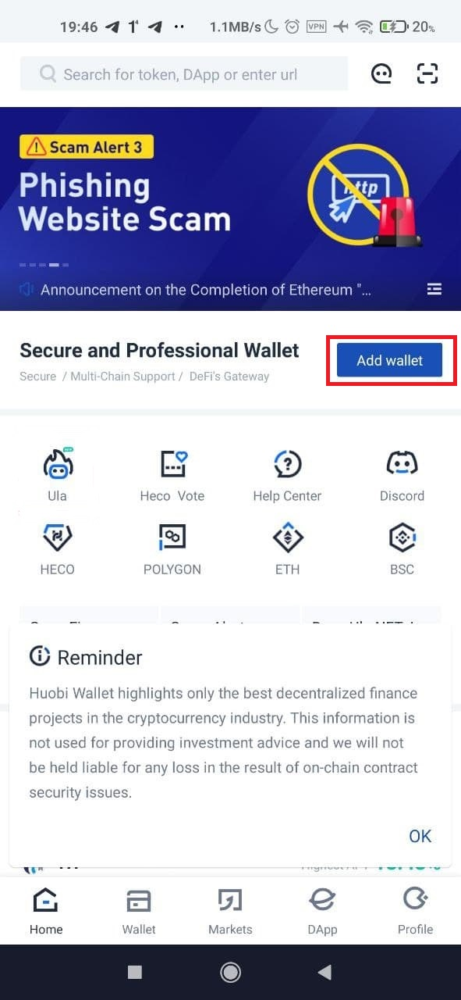

Pertama, buat wallet di aplikasi Huobi Wallet terlebih dahulu. Caranya:
1. Kunjungi situs web resmi https://www.huobiwallet.fi untuk mengunduh Huobi Wallet versi terbaru. 
2. Buka aplikasi Huobi Wallet, lalu klik 【Add wallet】 dan atur kata sandi keamanan. 

3. Pilih dompet: 【Standard Wallet】, lalu Pilih: Polygon.
4. Backup Frasa Mnemonik dengan menekan 【Backup Mnemonic Phrases】 dan simpan baik-baik.

Wallet sudah dibuat, sekarang klik 